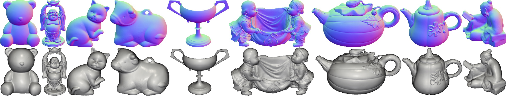

# [Normal Integration via Inverse Plane Fitting with Minimum Point-to-Plane Distance](https://openaccess.thecvf.com/content/CVPR2021/html/Cao_Normal_Integration_via_Inverse_Plane_Fitting_With_Minimum_Point-to-Plane_Distance_CVPR_2021_paper.html)

[Xu Cao](https://hoshino042.github.io/homepage/), [Boxin Shi](http://alumni.media.mit.edu/~shiboxin/), [Fumio Okura](http://cvl.ist.osaka-u.ac.jp/user/okura/) and [Yasuyuki Matsushita](http://www-infobiz.ist.osaka-u.ac.jp/en/member/matsushita/)

CVPR 2021

**2022.07 UPDATE: We have developed a new method substituting this method while allowing discontinuity preservation.
See [this repository](https://github.com/hoshino042/bilateral_normal_integration).
We believe there is no reason to use this repository any more in practice given the newly developed method.**



This repository contains the official python implementation of the CVPR'21 normal integration paper, along with our python implementations based on the following papers:
- "Variational Methods for Normal Integration", Quéau et al., Journal of Mathematical Imaging and Vision 60(4), pp 609--632, 2018. 
- "Normal Integration: a Survey", Quéau et al., Journal of Mathematical Imaging and Vision 60(4), pp 576--593, 2018. [Official Matlab Code](https://github.com/yqueau/normal_integration)
- "Least Squares Surface Reconstruction on Arbitrary Domains", Zhu et al., ECCV, 2020. [Official Matlab Code](https://github.com/waps101/LSQSurfaceReconstruction)
- "Surface-from-Gradients: An Approach Based on Discrete Geometry Processing", Xie et al., CVPR, 2014.
# Quick Start 
 cd to this repository's root folder and reproduce our anaconda environment by running
 
 ```
 conda env create -f=environment.yml 
 conda activate ni
 ```
 
 ## Experiments on orthographic normal maps
 run 
 ```
 python comparison_on_analytically_computed_orthographic_normal_maps.py
 ```
 
 This script compares 5 methods on 3 orthographic normal maps: sphere, vase, and anisotropic Gaussian.
 The results will be saved in `results/#TIME`.
 
 You can optionally add Gaussian noise and/or outliers to the input normal maps by running

  ```
  python comparison_on_analytically_computed_orthographic_normal_maps.py --noise 0.1
  python comparison_on_analytically_computed_orthographic_normal_maps.py --outlier 0.1
  python comparison_on_analytically_computed_orthographic_normal_maps.py --outlier 0.1 --noise 0.1
  ```
  The number after `--noise` is the standard deviation of Gaussian noise added to all normal vectors; the number after `--outlier` is the percentage (0~1) of outliers in the normal map.

## Experiments on perspective normal maps
- Download the perspective normal maps from [here](https://drive.google.com/file/d/13OpuH6MwM7-itXeLxO6WO8VhQTcKexHh/view?usp=sharing) and extract them under the `data` folder. 
These normal maps are picked out from [DiLiGenT dataset](https://sites.google.com/site/photometricstereodata/single?authuser=0).

- run
 ```
 python comparison_on_perspective_diligent_normal_maps.py
 ```

This script compares 6 perspective normal integration methods on 9 DiLiGenT objects. 

You might want to quickly check the results from a specific method on a specific object.
To this end, comment out the object names defined in `surface_name` list at line 19 and methods defined in `results` list at line 56.

As DiLiGenT contains normal maps estimated by different photometric stereo methods, 
you can check the normal integration results on these normal maps by modifying the `method_type` list defined in line 31.
For example, add "ECCV12Shi", "CVPR12Shi", etc. to the list.


## Visualization

To visualize the estimated mesh surfaces, run

``` python plot_surface.py --path #YOUR_FOLDER_CONTAINING_PLY_FILES```

A plot window of one surface will pop up, you can adjust the viewpoint that you would like to save as images.
Then close the window, the images of all meshes viewed from the adjusted viewpoint will be saved in your input folder. 

# Use Your Data

Choose the method you would like to use from `methods` folder and provide a .mat or a .npy file path.
For example:

```
python methods/perspective_five_point_plane_fitting.py --path data/sample_data/sample.npy
```

We recommend five point plane fitting in terms of the balance between robustness and computation time.

## Data Structure
The .mat or .npy file should contain following key-value pairs:
- `"normal_map"`: (H, W, 3) input normal map. This normal map should be defined in such a camera coordinate system: x-axis upwards, y-axis rightwards, and z-axis (the camera's principle axis) towards the scene. 
Check figure 1 in [our supplementary](https://openaccess.thecvf.com/content/CVPR2021/supplemental/Cao_Normal_Integration_via_CVPR_2021_supplemental.pdf) for a visualization. One correction for figure 1: u-axis and v-axis in the pixel coordinates should be swapped. 
- `"mask"`: (H, W) boolean mask indicating the region of interest to be integrated. Foreground should be 1; background should be 0.
- `"K"` (optional): the (3, 3) camera intrinsic matrix. You should prepare this matrix if you choose perspective normal integration methods. 
If you are not aware of the camera matrix, you can treat a perspective normal map as an orthographic one, and call orthographic normal integration methods.
There will be slight global distortion in the estimated surface.

# Citation
If you find our work useful in your research, please consider citing:
```
@inproceedings{cao2021normal,
  title={Normal Integration via Inverse Plane Fitting With Minimum Point-to-Plane Distance},
  author={Cao, Xu and Shi, Boxin and Okura, Fumio and Matsushita, Yasuyuki},
  booktitle={Proceedings of the IEEE/CVF Conference on Computer Vision and Pattern Recognition},
  pages={2382--2391},
  year={2021}
}
```

